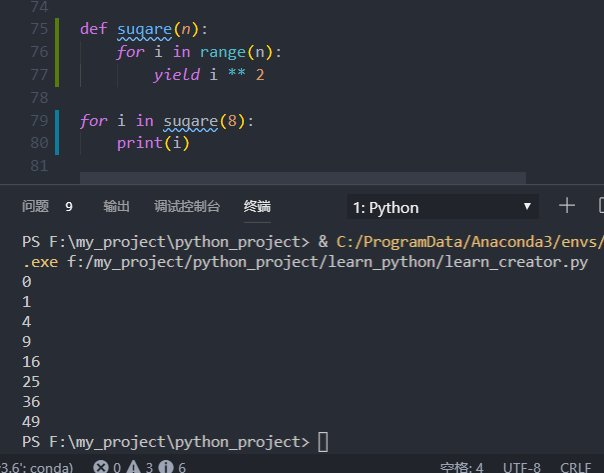

python关于迭代器(Iterator)和生成器(Constructor)

## 迭代器(Iterator)
在Python中，for循环可以用于Python中的任何类型，包括列表，元祖等，for循环可用于任何"可迭代对象",这其实就是迭代器。迭代器是一个实现了迭代器协议的对象，Python中的迭代器协议就是有next方法的对象会前进到下一个结果，而在一系列结果的末尾时，则会引发StopIteratoratiom。任何类的对象在Python中都可以使用for循环或其他遍历工具迭代，迭代工具内部会在每次迭代时调用next方法，并且捕捉StopIteration异常来确定何时离开。

使用迭代器的好处是:每次从对象中读取一条数据，不会造成太大的内存开销。

## 生成器(Constructor)
生成器函数在Python中与迭代器协议联系在一起，简而言之，包含yield语句的函数会被特地编译进生成器。当函数被调用时，他们会返回一个生成器对象，这个对象支持迭代器接口，函数也会会有return语句，但它的作用是用来给yield产生值的。
不像一般的函数会生成值后退出，生成器函数在生成值后会自动挂起并暂停他们的执行和状态，它的本地变量将保存状态信息，这些信息在函数恢复时将再度有效。

在爬虫实例中会经常看到生成器的运用。

## 为什么叫生成器函数？
因为它随着时间的推移生成一个数值队列。一般的函数在执行完毕后会返回一个值然后退出，但是生成器函数会自动挂起，然后重新拾起继续执行。它会利用yield关键字关起函数，给调用者返回一个值，同时保留了当前的足够多的的状态，可以使函数继续执行。生成器和迭代协议是密切相关的，可迭代的对象都有一个__next()__成员方法，这个方法要么返回迭代的下一项，要么引起异常结束迭代。
为了支持迭代协议，拥有yield语句的函数别编译成为生成器，这列函数被调用时返回一个生成器对象，返回的对象支持迭代接口，即成员方法__next()__继续从中断处执行。

