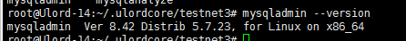

### 什么是数据库?

数据库（Database）是按照数据结构来组织、存储和管理数据的仓库，存储数据的介质。
每个数据库都有一个或多个不同的API用于创建，访问，管理，搜索和复制所保存的数据。
我们也可以将数据存储在文件中，但是在文件中读写数据速度相对较慢。
所以，现在我们使用关系型数据库管理系统（RDBMS）来存储和管理的大数据量。所谓的关系型数据库，是建立在关系模型基础上的数据库，借助于集合代数等数学概念和方法来处理数据库中的数据。

### 数据库的分类:
 	1. 关系型数据库(SQL)
 	2. 非关系型数据库(NoSQL:Not Only SQL)

#### RDBMS即关系数据库管理系统(Relational Database Management System)的特点：

	1.数据以表格的形式出现
	2.每行为各种记录名称
	3.每列为记录名称所对应的数据域
	4.许多的行和列组成一张表单
	5.若干的表单组成database

#### 对比：

#### 关系型数据库：

 	1. 安全，保存在磁盘
 	2. 数据结构：数据存储
 	3. 数据指令集合：SQL语句的集合
 	4. 完整性约束：表内数据约束，表与表之间的约束

#### 非关系型数据库：

​	1.不安全，存在内存中，但是效率高。

- 双中划线中间加空格 - - 注释单行 也可以使用#号

- 不能使用关键字进行数据库的创建，非要使用的话可以使用反引号修饰。esc键。

- DDL:Data Definition Language 数据定义语言

- DML:Data Manipulation Language 数据操作语言（DQL:Data Query Language 数据查询语言）

- DCL:Data Control Language 数据控制语言

### **RDBMS 术语** 

​	在我们开始学习MySQL 数据库前，让我们先了解下RDBMS的一些术语：

#### **数据库:** 

​	数据库是一些关联表的集合。.

#### **数据表:** 

​	表是数据的矩阵。在一个数据库中的表看起来像一个简单的电子表格。

#### 列:

​	一列(数据元素) 包含了相同的数据,      例如邮政编码的数据。

#### 行：

​	一行（=元组，或记录）是一组相关的数据，例如一条用户订阅的数据。

#### **冗余**：

​	存储两倍数据，冗余可以使系统速度更快。(表的规范化程度越高，表与表之间的关系就越多；查询时可能经常需要在多个表之间进行连接查询；而进行连接操作会降低查询速度。例如，学生的信息存储在student表中，院系信息存储在department表中。通过student表中的dept_id字段与department表建立关联关系。如果要查询一个学生所在系的名称，必须从student表中查找学生所在院系的编号（dept_id），然后根据这个编号去department查找系的名称。如果经常需要进行这个操作时，连接查询会浪费很多的时间。因此可以在student表中增加一个冗余字段dept_name，该字段用来存储学生所在院系的名称。这样就不用每次都进行连接操作了。)

#### **主键**：

​	主键是唯一的。一个数据表中只能包含一个主键。你可以使用主键来查询数据。

#### **外键：**

​	外键用于关联两个表。

#### 复合键：

​	复合键（组合键）将多个列作为一个索引键，一般用于复合索引。

#### 索引：

​	使用索引可快速访问数据库表中的特定信息。索引是对数据库表中一列或多列的值进行排序的一种结构。类似于书籍的目录。

#### 参照完整性: 

​	参照的完整性要求关系中不允许引用不存在的实体。与实体完整性是关系模型必须满足的完整性约束条件，目的是保证数据的一致性。

#### **Mysql安装的验证：**

​	在成功安装Mysql后，一些基础表会表初始化，在服务器启动后，你可以通过简单的测试来验证Mysql是否工作正常。
使用 mysqladmin 工具来获取服务器状态：
使用 mysqladmin 命令俩检查服务器的版本,在linux上该二进制文件位于 /usr/bin on linux ，在window上该二进制文件位于C:\mysql\bin 、

`mysqladmin --version`

linux上该命令将输出以下结果，该结果基于你的系统信息：

windows上该命令将输出以下结果，该结果基于你的系统信息：

如果没有显示任何信息，则证明你的Mysql没有安装成功。

#### **linux和windows上Mysql服务的启动:**

windows上只要启动对应的服务就可以，具体的方式就是我的电脑->管理->服务->然后找到对应的服务就可以了。也设置为开机自启。

Mysql默认安装时，目录介绍。

##### 1.数据库目录

`cd /var/lib/mysql`

##### 2.配置文件:mysql5.5之后的默认安装路径，mysql5.5之前的是/usr/local/mysql

`cd  /usr/share/mysql`

##### 3.相关命令

`/usr/bin/(mysqladmin mysqldump等)`

##### 4.脚本启动

`/etc/init.d/mysql start(restart|stop|status)`

##### 5.修改登录密码

 MySQL默认没有密码，安装完毕增加密码的重要性是不言而喻的。

  1、命令

  `usr/bin/mysqladmin -u root password 'new-password'`

  格式：mysqladmin -u用户名 -p旧密码 password 新密码

 