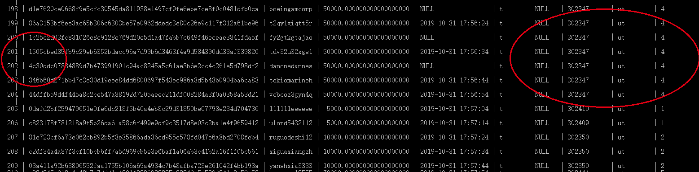
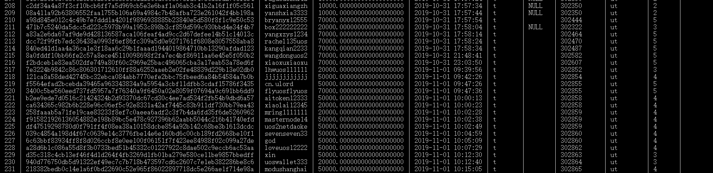

# 问题:
## sql中的字段带有特殊字符，破坏了表中字段的结构    
    解决思路，其中字段说明：
        `char(9)     水平制表符 `  
        `char(10)   换行`  
        `char(13)   回车`  
        去掉空格  
        `replace('字段',' ','')`  
        去掉回车换行符号
        `replace('字段',char(13)+char(10),'')`  
    

`UPDATE utdata SET period = REPLACE(REPLACE(REPLACE(REPLACE(REPLACE(period, CHAR(34),''),CHAR(13),''),CHAR(10),''),CHAR(9),''),' ','');`

